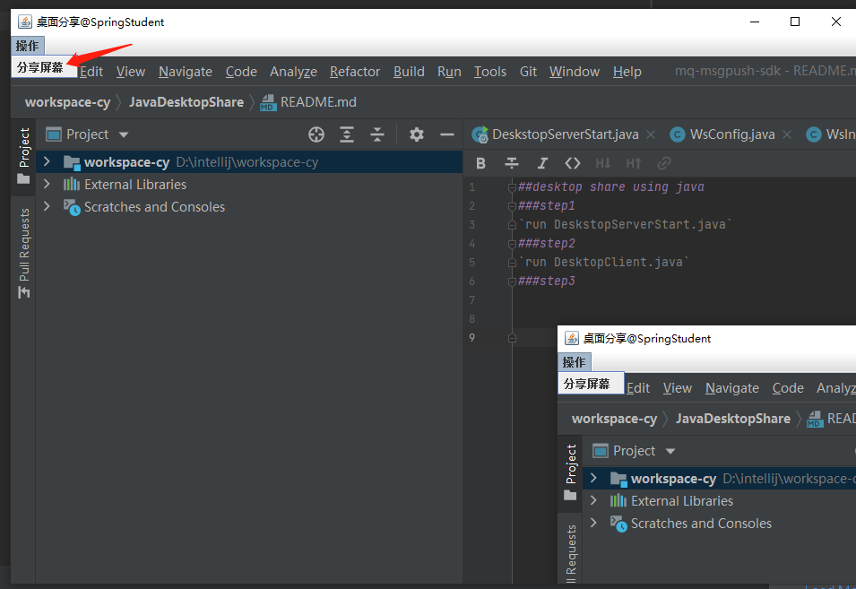
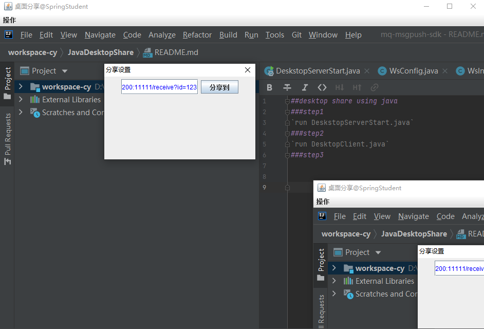
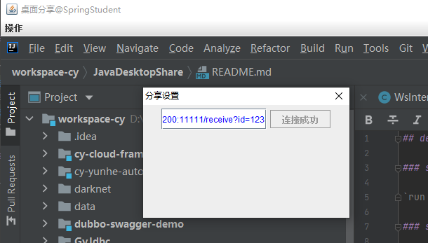
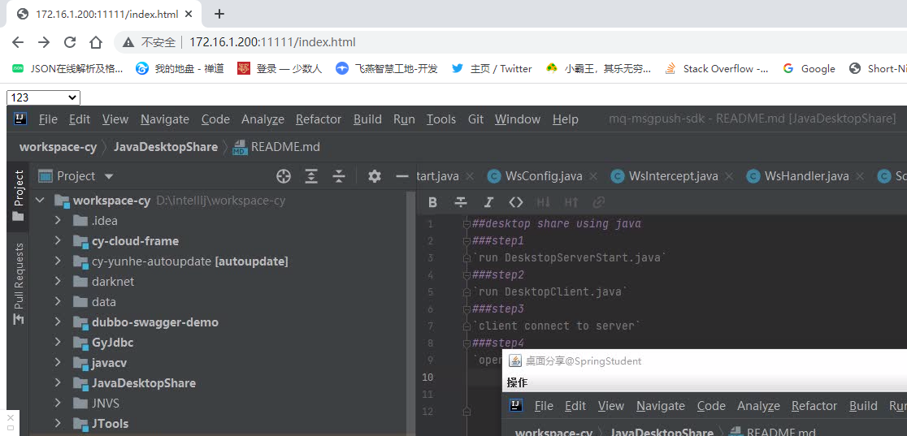

## desktop share using java

### step1

`modify index.html ajax http url and canvas ws url to your deploy desktopserver service ip port,then run DeskstopServerStart.java`

### step2

`modify ffmpeg path in DesktopClient.java,then run DesktopClient.java`

### step3

`in desktop client open menu`

`enter dialog,then input your desktop server url like http://172.16.1.72:11111/receive?id=xxx,note that id cannot chinese language or duplicate`

`click button and wait for success`

### step4

`in your browser visit http://{your desktopserver ip}:{your desktopserver port}/index.html,then choose your client to view`

### step5

`now you can enjoy it`